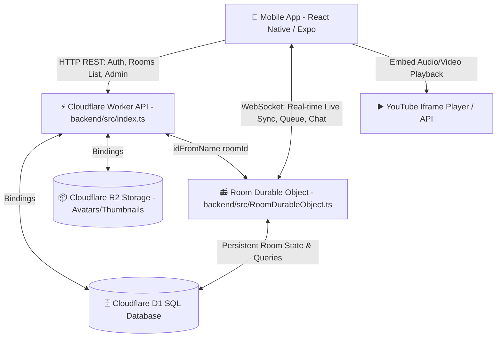

# 🎵 Hangloop — Live Music System Architecture & Data Flow Guide

Yeh document explain karta hai ki **Hangloop** ke andar currently song kaise play ho raha hai, playback engine ka internal structure kya hai, **User Queue** vs **App Queue (Catalog Fallback)** kaise kaam karte hain, aur frontend-backend ke beech data ka aana-jaana (WebSockets, REST APIs, Cloudflare D1, Durable Objects) step-by-step kaise hota hai.

---

## 📑 Table of Contents
1. [Overall Architecture & Tech Stack](#1-overall-architecture--tech-stack)
2. [Current Playback Structure (Song Kaise Play Ho Raha Hai)](#2-current-playback-structure)
3. [User Queue vs App Queue (Exact Working & Priority)](#3-user-queue-vs-app-queue)
4. [Live Sync & Timestamp Calculation (Sabhi Users Ek Hi Second Par Kaise Sunte Hain)](#4-live-sync--timestamp-calculation)
5. [Complete Data Flows & Lifecycle Diagrams](#5-complete-data-flows)
   - [Flow 1: User Joins a Room (Handshake & State Sync)](#flow-1-user-joins-a-room)
   - [Flow 2: Adding a Song to Queue](#flow-2-adding-a-song-to-queue)
   - [Flow 3: Song Transition & Auto-Advance (Queue vs Catalog)](#flow-3-song-transition--auto-advance)
   - [Flow 4: Track Failure & Auto-Recovery (Skip Dead Videos)](#flow-4-track-failure--auto-recovery)
   - [Flow 5: Live Chat & Kira AI Message Flow](#flow-5-live-chat--kira-ai)
   - [Flow 6: Moderation & User Timeouts](#flow-6-moderation--user-timeouts)
6. [Database Schema Mapping (D1 Tables)](#6-database-schema-mapping)
7. [Troubleshooting: `ts-node` Command Error & Catalog Seeding](#7-troubleshooting-ts-node--catalog-seeding)

---

## 1. Overall Architecture & Tech Stack



### Core Components:
1. **Frontend (`mobile/src/`)**:
   - `RoomScreen.tsx`: Main live listening room UI (player, chat, queue modal, members).
   - `YouTubePlayer.tsx`: Embedded YouTube player (handles seek synchronization, local pause isolation, track end/fail callbacks).
   - `websocket.ts`: Manages persistent WebSocket connection to Cloudflare Workers with auto-reconnect and heartbeat.
   - `api.ts`: Axios/Fetch client for REST endpoints (Login, OTP, Profile, Rooms list, Catalog search).

2. **Backend API (`backend/src/index.ts`)**:
   - Routes HTTP requests (`/api/rooms`, `/api/auth/*`, `/api/catalog/*`, `/api/admin/*`).
   - Routes WebSocket upgrade requests to the specific Room's Durable Object via `/api/ws/room/:roomId`.

3. **Real-time Stateful Room Engine (`backend/src/RoomDurableObject.ts`)**:
   - Ek dynamic serverless singleton instance per room (e.g. `room-bollywood-hindi`, `room-punjabi-hits`).
   - 24/7 continuous virtual radio host: maintains `currentVideo`, `queue`, `startTimestamp`, `seekPosition`, and alarms.

4. **Persistent Database (`backend/schema.sql` - Cloudflare D1)**:
   - `rooms`: Room definitions, current song metadata, active status.
   - `music_catalog`: Central verified library of songs (Bollywood, Punjabi, Trending, etc.).
   - `room_queue`: Persistent queue for each room.
   - `room_presence`: Active viewer sessions (heartbeat tracking).
   - `chat_messages`: Recent chat history.

---

## 2. Current Playback Structure

Hangloop ek **24/7 Synchronized Virtual Radio** architecture par chalta hai. Iska matlab: chahe room me 0 viewers hon ya 10,000 viewers, server-side playback kabhi stop nahi hota.

### Playback State Object (Held inside `RoomDurableObject`):
```typescript
interface PlaybackState {
  currentVideo: {
    id: string;              // e.g. "mc-1724140000" or "q-1724140000"
    videoId: string;         // 11-char YouTube ID (e.g. "BddP6PYo2gs")
    title: string;           // "Kesariya — Brahmāstra"
    artist: string;          // "Arijit Singh, Pritam"
    thumbnail: string;       // HQ thumbnail URL
    addedBy: string;         // Username who added, or "Hangloop Auto"
    durationSeconds: number; // e.g. 268 seconds
  } | null;
  isPlaying: boolean;        // true / false
  startTimestamp: number;    // Epoch ms when current track started
  seekPosition: number;      // Base seek offset in seconds
  queue: QueueItem[];        // Active User Queue
  theme: string;             // 'BOLLYWOOD' | 'PUNJABI' | 'LOFI_CHILL' | 'TRENDING'
}
```

### 3 Triggers Jo Song Ko Aage Badhate Hain (`advanceQueue`):
1. **Durable Object Server Alarm (Primary 24/7 Engine)**:
   - Jab koi song start hota hai, DO ek alarm schedule karta hai: `setAlarm(Date.now() + durationSeconds * 1000)`.
   - Jab alarm fire hota hai, DO automatically `advanceQueue()` call karta hai aur sabhi connected clients ko `PLAYBACK_SYNC` broadcast karta hai.
2. **Timeline Catch-up (`syncTimeline`)**:
   - Agar room me koi viewer nahi tha aur 2 ghante baad koi naya user join karta hai, toh `syncTimeline()` calculate karta hai ki pichhle 2 ghante me kitne songs khatam ho chuke hain, timeline ko aage scroll karta hai, aur user ko bilkul accurate live position par join karwata hai.
3. **Client Watchdog & End Events (`TRACK_ENDED` & `HEARTBEAT`)**:
   - Jab YouTube player song finish karta hai, client `TRACK_ENDED` event bhejta hai.
   - Client har 10 seconds me `HEARTBEAT` bhejta hai; agar DO dekhta hai ki `currentSeek >= duration + 1`, toh safety guard auto-advance kar deta hai.

---

## 3. User Queue vs App Queue

Hangloop me 2 alag-alag queues ka concept hai jo **Priority Cascade** par kaam karta hai:

```text
┌─────────────────────────────────────────────────────────────┐
│                    advanceQueue() Called                    │
└──────────────────────────────┬──────────────────────────────┘
                               │
                Is this.playbackState.queue > 0?
                               │
               ┌───────────────┴───────────────┐
             YES                               NO
               ▼                               ▼
    ┌─────────────────────┐        ┌────────────────────────┐
    │     USER QUEUE      │        │       APP QUEUE        │
    │ (Highest Priority)  │        │  (Catalog Fallback)    │
    ├─────────────────────┤        ├────────────────────────┤
    │ • User requested    │        │ • 24/7 Autoplay        │
    │ • Pop from queue    │        │ • Random pick from D1  │
    │ • Remove from D1    │        │ • Avoid last 25 played │
    │ • addedBy: Username │        │ • addedBy: HangloopAuto│
    └─────────────────────┘        └────────────────────────┘
```

### 1. User Queue (User dwara add kiya gaya song) — Priority #1:
- **Kaise Add Hota Hai**:
  1. User Room me jakar Search karta hai ya Song URL daalta hai aur "Add to Queue" dabata hai.
  2. Mobile App WebSocket par `{ type: 'ADD_QUEUE', videoId, title, artist, durationSeconds }` bhejti hai.
  3. DO `music_catalog` ya YouTube oEmbed se clean metadata nikalta hai.
  4. DO is item ko `this.playbackState.queue` me push karta hai aur D1 table `room_queue` me persist karta hai.
  5. DO sabhi room members ko `{ type: 'QUEUE_UPDATED', queue }` broadcast karta hai.
- **Playback Me Kaise Aata Hai**:
  - Jab current song end hota hai, `advanceQueue()` sabse pehle dekhta hai: `if (this.playbackState.queue.length > 0)`.
  - Queue ka pehla song pop (`shift()`) hota hai aur ban jata hai `currentVideo`.
  - D1 table `room_queue` se woh record delete kar diya jata hai.
  - `addedBy` me us user ka username dikhta hai jisne song add kiya tha.

### 2. App Queue (System Theme Catalog Fallback) — Priority #2:
- **Kaise Kaam Karta Hai**:
  - Agar User Queue empty hai (`queue.length === 0`), tab music rukta nahi hai!
  - DO turant `advanceToThemeCatalogTrack()` call karta hai.
- **3-Tier Intelligent Selection**:
  - **Tier 1 (Central D1 `music_catalog`)**:
    ```sql
    SELECT * FROM music_catalog 
    WHERE theme = ? AND is_active = 1 AND playable_status = 'PLAYABLE' 
    ORDER BY RANDOM() LIMIT 25
    ```
    - Filtering: DO pichhle **25 played songs** (`recentPlayedVideoIds`) aur **failed songs** (`failedVideoIds`) ko filter out karta hai taaki repeat na ho.
  - **Tier 2 (D1 `theme_catalog` Table)**:
    - Agar `music_catalog` me koi candidate na mile, toh secondary fallback table `theme_catalog` se pick karta hai.
  - **Tier 3 (Built-in Hardcoded Verified Pool `BUILTIN_POOL`)**:
    - Agar database connection me bhi issue aaye, toh code ke andar pre-verified real YouTube tracks ka pool hai (Bollywood, Punjabi, Lofi, Trending) jisse system 0% fail proof rehta hai.
  - Is song me `addedBy` hota hai `"Hangloop Auto"`.

---

## 4. Live Sync & Timestamp Calculation

Sabhi users poori duniya me ek hi second par song kaise sunte hain?

### Server-Side Calculation Formula:
```typescript
function getNormalizedPlaybackState(): PlaybackState {
  let currentSeek = this.playbackState.seekPosition;
  if (this.playbackState.isPlaying) {
    const elapsedSeconds = (Date.now() - this.playbackState.startTimestamp) / 1000;
    currentSeek += elapsedSeconds;
  }
  return {
    ...this.playbackState,
    seekPosition: Math.max(0, currentSeek)
  };
}
```

### Client-Side Join & Sync:
1. Naya user room join karta hai -> WebSocket connect hota hai.
2. DO use `INIT_STATE` bhejta hai jisme `currentVideo` aur exact calculated `seekPosition` (e.g. 42.5 seconds) hota hai.
3. Mobile App ka `YouTubePlayer` video load karta hai aur turant `seekTo(42.5)` kar deta hai.
4. **Local Pause Isolation**: Agar koi user local pause karta hai, toh server ya doosre users ka song pause nahi hota.
5. **🔴 LIVE Button**: Agar user pause karne ke baad wapas live sync chahta hai, toh LIVE button click karte hi player re-sync ho jata hai.

---

## 5. Complete Data Flows & Lifecycle Diagrams

### Flow 1: User Joins a Room
```text
[Mobile App]                           [Worker API]                  [Room Durable Object]             [D1 Database]
     │                                      │                                  │                             │
     ├──── GET /api/rooms ─────────────────>│                                  │                             │
     │<─── Returns Rooms + Active Viewers ──┤                                  │                             │
     │                                      │                                  │                             │
     ├──── WebSocket Connect ──────────────>│                                  │                             │
     │     /api/ws/room/:roomId             ├──── Upgrade & Forward ──────────>│                             │
     │                                      │                                  ├──── Record Presence ───────>│
     │                                      │                                  │     INSERT room_presence    │
     │<─── WS: INIT_STATE ──────────────────┴──────────────────────────────────┤                             │
     │     (currentVideo, seekPosition, queue, chatLogs, members, isHost)       │                             │
     │                                                                         │                             │
     │───▶ [YouTubePlayer] starts video & seeks to seekPosition ───────────────┤                             │
```

---

### Flow 2: Adding a Song to Queue
```text
[User / Mobile App]                  [Room Durable Object]                       [D1 Database]
         │                                     │                                       │
         ├──── WS: ADD_QUEUE ─────────────────>│                                       │
         │     { videoId: "xyz123" }           ├──── Check music_catalog ─────────────>│
         │                                     │<─── (Clean title, artist, duration) ──┤
         │                                     │                                       │
         │                                     ├──── Insert into room_queue ──────────>│
         │                                     │     INSERT INTO room_queue...         │
         │                                     │                                       │
         │<─── WS: QUEUE_UPDATED ──────────────┤ (Broadcast to ALL room members)       │
         │     { queue: [item1, item2...] }    │                                       │
```

---

### Flow 3: Song Transition & Auto-Advance
```text
[DO Alarm / Client TRACK_ENDED]
              │
              ▼
   [advanceQueue() Triggered]
              │
              ├──▶ Check this.playbackState.queue
              │
     ┌────────┴────────────────────────────────────────┐
     ▼                                                 ▼
[User Queue > 0]                              [User Queue == 0]
     │                                                 │
     ├─ Pop nextItem from queue                        ├─ advanceToThemeCatalogTrack()
     ├─ DELETE FROM room_queue in D1                   ├─ SELECT * FROM music_catalog WHERE theme=?
     ├─ startTimestamp = Date.now()                    ├─ Pick random excluding last 25 played
     ├─ seekPosition = 0                               ├─ startTimestamp = Date.now()
     │                                                 ├─ seekPosition = 0
     └────────────────────────┬────────────────────────┘
                              │
                              ▼
           [Update D1 rooms table with currentVideo]
                              │
                              ▼
           [Broadcast to ALL connected clients via WS]
             - Event: PLAYBACK_SYNC
             - Event: QUEUE_UPDATED
                              │
                              ▼
           [Schedule next DO Alarm for (now + durationMs)]
```

---

### Flow 4: Track Failure & Auto-Recovery (Skip Dead Videos)
```text
[Mobile App / YouTubePlayer]            [Room Durable Object]                    [D1 Database]
            │                                     │                                    │
    (Video Deleted / Error 150)                   │                                    │
            │                                     │                                    │
            ├──── WS: TRACK_FAILED ──────────────>│                                    │
            │     { videoId: "dead_vid" }         ├──── Add to failedVideoIds cache    │
            │                                     ├──── recordSongFailure() ──────────>│
            │                                     │     (Mark status 'FAILED' in D1)   │
            │                                     │                                    │
            │                                     ├──── Auto advanceQueue()            │
            │                                     │     (Circuit breaker: max 5 tries) │
            │                                     │                                    │
            │<─── WS: PLAYBACK_SYNC ──────────────┤ (Broadcast next playable track)    │
            │     (Instant seamless skip)         │                                    │
```

---

### Flow 5: Live Chat & Kira AI
```text
[User / Mobile App]                  [Room Durable Object]                       [Kira AI Service]
         │                                     │                                         │
         ├──── WS: CHAT_SEND ─────────────────>│                                         │
         │     { text: "@kira play romantic" } ├──── Save to chat_messages in D1         │
         │                                     ├──── Broadcast CHAT_RECEIVE to all       │
         │                                     │                                         │
         │                                     ├──── Detect isKiraCommand(text) ────────>│
         │                                     │                                         ├─ Workers AI / Gemini
         │                                     │<─── Kira AI Reply Message ──────────────┤
         │                                     │                                         │
         │<─── WS: CHAT_RECEIVE ───────────────┤ (Broadcast Kira response to all)        │
         │     { sender: "Kira 🤖", text: ... }│                                         │
```

---

## 6. Database Schema Mapping

| Table Name | Primary Key | Key Columns | Purpose |
|---|---|---|---|
| `rooms` | `id` | `name`, `theme`, `current_video_id`, `started_at`, `play_source_type` | Persistent room definitions & current playing track. |
| `music_catalog` | `id` | `youtube_video_id`, `song_name`, `artist`, `theme`, `playable_status`, `failure_count` | Master library of verified songs used for App Queue autoplay. |
| `room_queue` | `id` | `room_id`, `video_id`, `title`, `artist`, `added_by`, `order_index` | Live User Queue per room. |
| `room_presence` | `session_id` | `room_id`, `user_id`, `username`, `last_seen` | Tracks active online viewers in each room (30s heartbeat). |
| `chat_messages` | `id` | `room_id`, `sender_id`, `sender_name`, `text`, `created_at` | Chat history per room. |
| `moderators` | `id` | `user_id`, `username`, `can_timeout_users`, `can_kick_users` | Room moderation permissions. |
| `song_requests` | `id` | `query`, `requested_by`, `status`, `synced_song_id` | Tracks user song requests submitted via search/sync. |

---

## 7. Troubleshooting: `ts-node` Command Error & Catalog Seeding

### ❌ Kyu Aaya Yeh Error:
```text
ts-node : The term 'ts-node' is not recognized as the name of a cmdlet...
```
`ts-node` globally installed nahi hai Windows system par, aur backend ek **Cloudflare Worker project** hai jo `wrangler` aur TypeScript bundler use karta hai.

### ✅ Catalog Seed Karne Ka Sahi Tarika:

#### Option A: Direct Backend API Endpoint Se Seed Karna (Recommended):
Backend ke andar seed API endpoint bana hua hai:
```bash
# Super Admin Token ya Direct Curl Call:
curl -X POST https://hangloop-api.milansharma942105.workers.dev/api/admin/catalog/seed-full \
  -H "Content-Type: application/json"
```

#### Option B: `npx tsx` Se Local Script Run Karna:
Agar local terminal se seed script run karni hai bina global install ke:
```bash
cd c:\Users\cc\Music\Hangloop\backend
npx tsx src/catalogSeedData.ts
```

#### Option C: Wrangler D1 Execute Se SQL Batch Insert:
```bash
cd c:\Users\cc\Music\Hangloop\backend
npx wrangler d1 execute hangloop-db --file=./scripts/batch_bollywood.sql --remote
```
